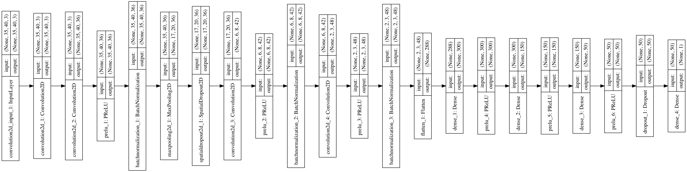

# Training model for Udacity SDC simulator
The goal of this project is to create a DNN model which can predict steering angle for simulated car, based on an image from the front camera of the car.

Video result can be seen [here](https://www.youtube.com/watch?v=smpTdRKwt6Y).

## Data
The car has 3 cameras: left, center and right. Cameras provide 160x320x3 RGB images.
The center image will be used for both training and predicting.
The left and right images will be used to increase amount of data, the angles for those images will be calculated by slightly changing the angle for center image.
Another way to increase amount of data is to add horizontaly flipped copy of the images.

## Preprocessing
The top part of every image contains sky. This information will be useless for predicting the angle, so images will be cropped by 65 pixels from the top.
The bottom part of every image contains a part of the car, which will be also useless, so images will be cropped by 25 pixels from the bottom.
After cropping(70x320x3), image will be resized to 35x40x3 size, which decreases amount of used memory and increased training process.
Finally, image will be normilized, to get values in the range from 0 to 1.

## Data generator
To avoid keeping all images in the memory(what can be even impossible), data generator will be used, which load only batch of images of chosen size at a time.
Another benefit of the data generator in Keras, that data generation and training are executed in parallel, so data can be generated using CPU while the training is done on GPU.

## Designing Architecture
Since the prediction should be done by analizing images, the convolution layers will be used to extract feature information.
To reduce spatial size of representation and to control overfitting maxpooling layers will be used.
To calculate the prediction from extracted features, fully-connected layers will follow the convolution layes.
To introduce non-linearity, all convolution and fully-connected layers, except last layer, will be followed by PReLU activation function.
Last fully-connected layer will used 'tanh' activation to generate output in range from -1 to 1 (steering angle),

## Training the model
Though common logic is pretty simple, there is no straight answer how all those layers should be combined.
To come with the final architecture which would satisfy the requirement, following approach was used:
* start with simple architecture and increase number of layers and parameters trying to overfit the training data.
* to make the model to generalize better to unseen data splt data into training and validation sets and add dropout layers
* final decision about how good the model is working will be done by checking it on the simulator.

## Final Architecture

Visualization of the layers could be seen there: [html](http://htmlpreview.github.io/?https://github.com/alarionov/behavioral_cloning/blob/master/visualization.html)|[ipynb](Behavioral_Cloning.ipynb)

Video result can be seen [here](https://www.youtube.com/watch?v=smpTdRKwt6Y).

Usage:
```
python model.py PATH [OPTIONS]

Where:
  PATH is a path to a directory with a CSV file containing driving logs

  OPTIONS:
		--weights Path to a file with default weights.
		--batch   Batch size. 512 by default.
		--epochs  Number of epochs. 10 by default.
		--lr      Learning rate. 0.0001 by default.
```
Script will generate `mode.json` and `model.h5` files.
`model.json` contains a model
`model.h5` contains weights for the model and might be used as default weights for next training.
